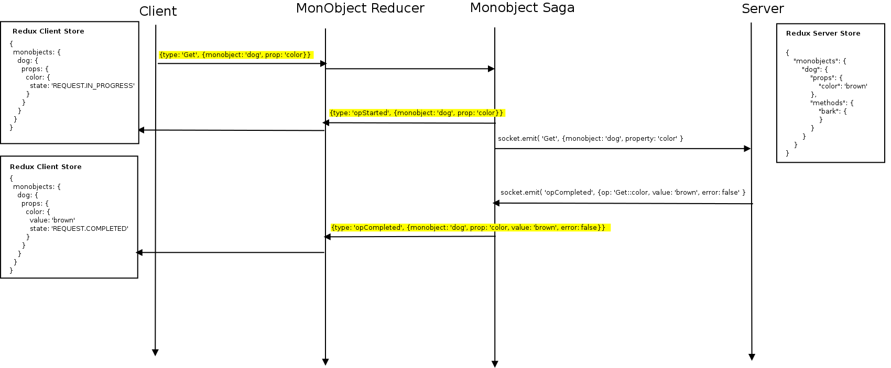

# Remote-Redux-Five -- A Distributed Redux Micro-Service Example

## Goals

1. Define a standard protocol for manipulating remote redux stores.
2. Define a redux state shape to support a standard communication protocol.

### Motivations
 * Use redux on the server. Just as redux dev tools is great for UI development, wouldn't it be great to run a similar tool to simulate various conditions on the micro-service layer? In doing so, we can simulate events and demo our applications to  stakeholders without ever needing to alter production databases, code, or physical equipment. 
 * Using a standard protocol allows us to reuse code across applications. No matter what the underlying transport is ( web sockets, bluetooth-ble, electron ipc, etc... ), the only thing that changes is a single saga. 
 * Reduce boilerplate and provide a base to build apps on.   

## Redux State Store
**_The client and the server have their own stores. While they might be similar, they are not the same_**.


### Client
**_An example client state tree_**.

```javascript

export const REQUEST = {
    IN_PROGRESS: 'IN_PROGRESS',
    COMPLETED: 'COMPLETED',
    ERROR: 'ERROR'
};

{
  monobjects: {
    dog: {
      props: {
        color: {
          value: 'brown',
          state: REQUEST.COMPLETED
        }
      },
      methods: {
        bark: {
          value: "Arroof",
          state: REQUEST.COMPLETED
        },
        sit: {
          state: REQUEST.INPROGRESS
        },
        rollOver: {
          state: REQUEST.ERROR
        }
      }
    }
  }
}

```

### Server
**_The state tree of this example application_**.
```javascript
{
    "monobjects": {
        "dog": {
            "props": {
                "color": 'brown'
            },
            "methods": {
                "bark": {
                    "ret": "return code",
                    "state": "COMPLETED"
                }
            }
        }
    }
}

```

### Reducer Composition
In order to support the protocol, reducers should insert there state inside the monobjects tree, and provide props and methods. In this example dog is a valid monobject reducer. Other state can exist along side the monobject state, but it will not be accessible from the protocol. 


### Get Action Flow


## The Five Actions
**_All actions operate in the context of a monobject, which is really just a slice of the redux state tree_**.
 
```javascript

//Action Creators

//get a remote property from a redux store
export function get(monobject, property) {
    return {
        type: SEND_REQUEST,
        payload: {
            message: "Get",
            data: {
                monObject: monobject,
                property: property
            }
        }
    };
}

//listen for updates on a remote property
export function watch(monobject, property) {
    return {
        type: SEND_REQUEST,
        payload: {
            message: "Watch",
            data: {
                monObject: monobject,
                property: property
            }
        }
    };
}

//sets a remote property in a redux store
export function set(monobject, property, value) {
    return {
        type: SEND_REQUEST,
        payload: {
            message: "Set",
            data: {
                monObject: monobject,
                property: property,
                value: value
            }
        }
    };
}

//call a remote method
export function call(monobject, method, args) {
    return {
        type: SEND_REQUEST,
        payload: {
            message: "Call",
            data: {
                monObject: monobject,
                method: method,
                args: args
            }
        }
    };
}

//stop listening for updates on a remote property
export function unwatch(monobject, property) {
    return {
        type: SEND_REQUEST,
        payload: {
            message: "UnWatch",
            data: {
                monObject: monobject,
                property: property
            }
        }
    };
}


```

## Instructions

  Open two terminals.

  In first terminal
   * cd server
   * npm install
   * npm start

   * In second terminal
   * cd client
   * npm install
   * webpack-dev-server --host YOUR_IP_ADDRESS

   * browser http://IPADDR:8080
